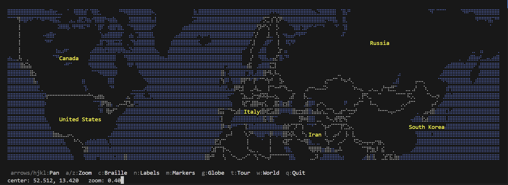

# 🗺️ TerminalMap

**The entire world, rendered in your terminal.** A high precision, interactive map viewer and embeddable Rust SDK that turns OpenStreetMap vector tiles into beautiful braille/ASCII art, right in any terminal.

Works offline at low zoom. No API keys. No external dependencies. Just a terminal.



---

> 🦀 **Made with love using Rust** | 💻 For terminal lovers | 🌍 Powered by OpenStreetMap

---

## 🤔 What is this

TerminalMap is two things:

1. **A standalone terminal app** 🖥️ for browsing OpenStreetMap interactively with keyboard and mouse
2. **A Rust library (SDK)** 📦 you can embed in any TUI application to add live, zoomable maps

It renders Mapbox Vector Tiles (MVT/protobuf) using Unicode braille characters at 2x8 subpixel resolution per terminal cell, giving you smooth, detailed maps at every zoom level from continents down to individual streets.

### 🙌 Who is this for?

- 🦀 **Rustaceans** who want a real world use case for terminal rendering
- 💻 **Terminal enthusiasts** who live in the command line
- 🗺️ **GIS and mapping nerds** exploring vector tiles and OpenStreetMap data
- 🧑‍💻 **TUI developers** building dashboards, DevOps tools, or monitoring UIs
- 🎨 **Creative coders** experimenting with braille art and Unicode rendering
- 🌍 **Open source advocates** looking for API free, self contained mapping
- 📡 **DevOps and SRE teams** who want geographic context in terminal dashboards
- 🏠 **Offline first builders** needing maps without network dependencies

## ✨ Features

- 🔤 Renders OpenStreetMap vector tiles using Unicode braille characters for high resolution
- 🔎 Smooth zoom from world view to street level (zoom 0 to 18)
- ⌨️ Keyboard and mouse navigation (pan, zoom, scroll)
- 📐 Full Mapbox Vector Tile (MVT/protobuf) parsing
- 🎨 Mapbox GL style support with layer filtering and color mapping
- 🏷️ Label collision detection to avoid overlapping text
- 🔺 Polygon triangulation and filled rendering
- 💾 Tile caching (in memory LRU + persistent disk cache)
- 📦 Embedded offline tiles for low zoom (world view works without network)
- 🔁 Toggle between braille and ASCII block character rendering
- 📍 Marker system with shapes, colors, and animations (blink, pulse, flash)
- 🎬 Scriptable camera with smooth fly to animation between locations
- 🖼️ Multiple independent map instances for dashboards and split views
- 🧩 Designed as a reusable library component with `MapState` API

## 🚀 Quick Start

### Install and run

```bash
git clone https://github.com/psmux/TerminalMap.git
cd TerminalMap
cargo run --release
```

### 🎮 Controls

| Key | Action |
|-----|--------|
| Arrow keys / h,j,k,l | Pan the map |
| a / + | Zoom in |
| z / y / - | Zoom out |
| c | Toggle braille/ASCII mode |
| n | Toggle labels on/off |
| m | Toggle demo markers |
| g | Start/stop globe tour (auto camera) |
| t | Start/stop marker tour |
| w | Fit world view |
| Mouse scroll | Zoom in/out |
| q / Esc | Quit |

### 📦 As a library (Map SDK)

TerminalMap is designed as a **reusable map component** you can embed in any Rust TUI application. Each `MapState` is an independent map instance with its own center, zoom, markers, and renderer. You can create as many as you need and place them wherever you want in your layout.

Add to your `Cargo.toml`:

```toml
[dependencies]
terminalmap = { path = "path/to/TerminalMap" }
tokio = { version = "1", features = ["full"] }
anyhow = "1"
```

#### 🧪 Minimal example

```rust
use terminalmap::config::MapConfig;
use terminalmap::widget::MapState;

#[tokio::main]
async fn main() -> anyhow::Result<()> {
    let config = MapConfig::default();
    let mut map = MapState::new(config).await?;
    map.set_size_from_terminal(120, 40);

    let frame = map.render().await?;
    print!("{}", frame);

    Ok(())
}
```

#### 🗺️ Startup view recipes

Control exactly what the user sees when the map first loads:

```rust
use terminalmap::config::MapConfig;
use terminalmap::widget::MapState;

// 1. Zoomed out world view (default behavior)
let mut map = MapState::new(MapConfig::default()).await?;
map.set_size_from_terminal(cols, rows);
// zoom auto fits the terminal

// 2. Centered on a specific city
let config = MapConfig {
    initial_lat: 40.7128,
    initial_lon: -74.0060,
    initial_zoom: Some(6.0),  // city region level
    ..MapConfig::default()
};
let mut map = MapState::new(config).await?;

// 3. Fit the whole world (auto calculated zoom)
let mut map = MapState::new(MapConfig::default()).await?;
map.set_size_from_terminal(cols, rows);
map.fit_world();

// 4. Country level view of Japan
let config = MapConfig {
    initial_lat: 36.2048,
    initial_lon: 138.2529,
    initial_zoom: Some(3.0),  // country level
    ..MapConfig::default()
};
let mut map = MapState::new(config).await?;

// 5. Street level detail
let config = MapConfig {
    initial_lat: 48.8584,
    initial_lon: 2.2945,   // Eiffel Tower
    initial_zoom: Some(14.0),
    ..MapConfig::default()
};
let mut map = MapState::new(config).await?;
```

#### ⌨️ Handling keyboard and mouse input

TerminalMap does not capture input on its own. You wire up whatever keys you want to the `MapState` methods. Here is a complete example using crossterm:

```rust
use crossterm::event::{self, Event, KeyCode, KeyEventKind, MouseEventKind};
use terminalmap::config::MapConfig;
use terminalmap::widget::MapState;

// In your event loop:
loop {
    if event::poll(std::time::Duration::from_millis(50))? {
        match event::read()? {
            Event::Key(key) if key.kind == KeyEventKind::Press => {
                match key.code {
                    // Zoom
                    KeyCode::Char('+') | KeyCode::Char('a') => map.zoom_by(0.2),
                    KeyCode::Char('-') | KeyCode::Char('z') => map.zoom_by(-0.2),

                    // Pan (scales with zoom so movement feels consistent)
                    KeyCode::Up    => map.move_by( 6.0 / 2f64.powf(map.zoom), 0.0),
                    KeyCode::Down  => map.move_by(-6.0 / 2f64.powf(map.zoom), 0.0),
                    KeyCode::Left  => map.move_by(0.0, -8.0 / 2f64.powf(map.zoom)),
                    KeyCode::Right => map.move_by(0.0,  8.0 / 2f64.powf(map.zoom)),

                    // Jump to a location
                    KeyCode::Char('1') => { map.set_center(40.7128, -74.006); map.zoom = 6.0; }
                    KeyCode::Char('2') => { map.set_center(35.6762, 139.650); map.zoom = 6.0; }

                    // Fit world
                    KeyCode::Char('w') => map.fit_world(),

                    // Toggle labels
                    KeyCode::Char('n') => map.toggle_labels(),

                    _ => continue,
                }
                // Redraw after any input
                let frame = map.render().await?;
                // draw frame to terminal...
            }
            Event::Mouse(mouse) => {
                match mouse.kind {
                    MouseEventKind::ScrollUp   => map.zoom_by(0.2),
                    MouseEventKind::ScrollDown => map.zoom_by(-0.2),
                    _ => continue,
                }
                let frame = map.render().await?;
                // draw frame...
            }
            Event::Resize(cols, rows) => {
                map.set_size_from_terminal(cols, rows);
                let frame = map.render().await?;
                // draw frame...
            }
            _ => {}
        }
    }

    // Drive animations
    map.advance_tick();
    if map.needs_animation_redraw() {
        map.update_camera();
        let frame = map.render().await?;
        // draw frame...
    }
}
```

The zoom/pan math is simple:
- `zoom_by(0.2)` zooms in one step, `zoom_by(-0.2)` zooms out
- `move_by(dlat, dlon)` pans by a delta. Divide by `2^zoom` so panning feels the same speed at any zoom level
- `set_center(lat, lon)` jumps instantly to a coordinate
- `fit_world()` auto calculates zoom to show all landmass

#### 🖼️ Multiple maps side by side

Each `MapState` is fully independent. Create as many as you need for split views, dashboards, or comparison layouts:

```rust
let mut world = MapState::new(MapConfig::default()).await?;
world.set_size(160, 80);
world.fit_world(); // auto zoom to show all landmass

let mut detail = MapState::new(MapConfig {
    initial_lat: 48.8566,
    initial_lon: 2.3522,
    initial_zoom: Some(12.0),
    ..MapConfig::default()
}).await?;
detail.set_size(160, 80);

let world_frame = world.render().await?;
let detail_frame = detail.render().await?;
// Position each frame wherever you want in your TUI layout
```

### 📍 Markers

TerminalMap includes a full marker system for plotting points of interest on the map. Markers support custom colors, shapes, animations, and labels.

#### Adding markers

```rust
use terminalmap::marker::{MapMarker, MarkerAnimation, MarkerShape};

// Simple colored dot (lat, lon, r, g, b)
map.add_marker(
    MapMarker::dot_rgb(40.7128, -74.0060, 255, 50, 50)
        .with_label("New York")
        .with_id("nyc"),
);

// Or use xterm-256 color index directly
map.add_marker(MapMarker::dot(51.5074, -0.1278, 196));
```

#### Marker shapes

| Shape | Code | Description |
|-------|------|-------------|
| Dot | `MarkerShape::Dot` | 3x3 filled dot (default) |
| Cross | `MarkerShape::Cross` | + shaped cross |
| Diamond | `MarkerShape::Diamond` | Diamond outline |
| Ring | `MarkerShape::Ring(radius)` | Circle outline |
| Filled circle | `MarkerShape::FilledCircle(radius)` | Solid circle |
| Character | `MarkerShape::Char('X')` | Any Unicode character |

```rust
map.add_marker(
    MapMarker::dot_rgb(35.6762, 139.6503, 255, 200, 0)
        .with_label("Tokyo")
        .with_shape(MarkerShape::Diamond)
        .with_id("tokyo"),
);

map.add_marker(
    MapMarker::dot_rgb(55.7558, 37.6173, 0, 255, 128)
        .with_label("Moscow")
        .with_shape(MarkerShape::FilledCircle(4))
        .with_id("moscow"),
);
```

#### Marker animations

| Animation | Code | Effect |
|-----------|------|--------|
| None | `MarkerAnimation::None` | Static, always visible |
| Blink | `MarkerAnimation::Blink` | On/off cycle (~400ms) |
| Flash | `MarkerAnimation::Flash` | Rapid on/off (~150ms) |
| Pulse | `MarkerAnimation::Pulse` | Ring radius grows and shrinks (use with `Ring` shape) |

```rust
// Blinking alert marker
map.add_marker(
    MapMarker::dot_rgb(34.0522, -118.2437, 255, 0, 0)
        .with_label("ALERT")
        .with_animation(MarkerAnimation::Blink)
        .with_id("la_alert"),
);

// Pulsing radar effect
map.add_marker(
    MapMarker::dot_rgb(37.7749, -122.4194, 0, 200, 255)
        .with_label("SF")
        .with_animation(MarkerAnimation::Pulse)
        .with_shape(MarkerShape::Ring(3))
        .with_id("sf_radar"),
);
```

For animations to work, call `map.advance_tick()` on each frame/poll cycle in your event loop.

#### Managing markers

```rust
// Remove a marker by ID
map.remove_marker("nyc");

// Clear all markers
map.clear_markers();

// Read all markers
for marker in map.markers() {
    println!("{}: {:.2}, {:.2}", marker.id, marker.lat, marker.lon);
}

// Check if animations need redraws
if map.has_animated_markers() {
    map.advance_tick();
    // trigger redraw
}
```

### 🧩 MapState API reference

| Method | Description |
|--------|-------------|
| `MapState::new(config)` | Create a new map instance |
| `set_size(w, h)` | Set canvas size in pixels (cols*2, rows*4) |
| `set_size_from_terminal(cols, rows)` | Set size from terminal dimensions |
| `render()` | Render the current view to an ANSI string |
| `zoom_by(step)` | Zoom in (positive) or out (negative) |
| `move_by(dlat, dlon)` | Pan the map by a lat/lon delta |
| `set_center(lat, lon)` | Jump to specific coordinates |
| `fit_world()` | Auto zoom to show all landmass |
| `toggle_braille()` | Switch between braille and ASCII block rendering |
| `toggle_labels()` | Toggle country/city/POI labels on/off |
| `footer()` | Get status text with current position and zoom |
| `add_marker(marker)` | Add a marker to the map |
| `remove_marker(id)` | Remove a marker by its ID |
| `clear_markers()` | Remove all markers |
| `markers()` | Get a reference to all markers |
| `advance_tick()` | Advance animation frame counter |
| `has_animated_markers()` | Check if any markers have animations |
| `start_globe_tour()` | Start a country level globe tour |
| `start_globe_tour_at(zoom)` | Start a globe tour at a specific zoom level |
| `start_marker_tour(zoom)` | Tour all markers at the given zoom |
| `toggle_camera()` | Toggle the camera on/off |
| `update_camera()` | Advance camera one frame (call each tick) |
| `camera()` / `camera_mut()` | Access the camera controller |
| `needs_animation_redraw()` | Check if markers or camera need redraws |

### 🎬 Camera / auto animation

TerminalMap includes a scriptable camera that smoothly flies the map between locations. It works out of the box with one line, or you can fully script your own tour.

#### Quick start (one liner)

```rust
// Country level globe tour (the default)
map.start_globe_tour();

// Or pick a zoom level: 2.0 = countries, 4.0 = regions, 6.0 = streets
map.start_globe_tour_at(4.0);

// Tour your own markers instead
map.start_marker_tour(3.0);

// Stop anytime
map.camera_mut().stop();
```

#### Zoom level guide

| Zoom | What you see | Good for |
|------|-------------|----------|
| 1.0 | Continents | World overview |
| 2.0 | Countries | **Globe tour default** |
| 4.0 | Metro regions | City context |
| 6.0 | City streets | Street level detail |
| 8.0+ | Neighborhoods | Close inspection |

#### Custom scripted tour (5 lines per stop)

```rust
use terminalmap::camera::{Camera, Waypoint};

let mut cam = Camera::new();
cam.looping = true;

// Each waypoint: where to go, how zoomed in, how fast, how long to stay
cam.add_waypoint(
    Waypoint::new(40.7128, -74.0060, 3.0) // lat, lon, zoom
        .with_label("New York")
        .with_travel(80)  // ~4 seconds to fly here
        .with_hold(60),   // ~3 seconds to stay
);
cam.add_waypoint(
    Waypoint::new(51.5074, -0.1278, 3.0)
        .with_label("London")
        .with_travel(100)
        .with_hold(50),
);

// Load and go
*map.camera_mut() = cam;
map.camera_mut().start(map.center_lat, map.center_lon, map.zoom);
```

#### Change zoom on the fly

Already have a tour but want to switch between country and city level?

```rust
// Switch an existing tour to street level
map.camera_mut().set_zoom(6.0);

// Or back to country level
map.camera_mut().set_zoom(2.0);
```

#### Activity driven camera

Point the camera at markers or events on your map. Combine markers with the camera to build a live dashboard that automatically pans to activity:

```rust
// Add markers for active locations
map.add_marker(
    MapMarker::dot_rgb(52.52, 13.405, 255, 0, 0)
        .with_label("Server alert")
        .with_animation(MarkerAnimation::Blink)
        .with_id("alert_berlin"),
);

// Then tour all markers automatically
map.start_marker_tour(4.0);
```

New markers added later? Just rebuild the tour:

```rust
map.start_marker_tour(4.0); // picks up all current markers
```

#### Driving the camera in your event loop

Call `update_camera()` every tick. It returns `true` when the view changed:

```rust
loop {
    map.advance_tick();
    let moved = map.update_camera();
    if moved || map.has_animated_markers() {
        let frame = map.render().await?;
        // draw frame...
    }
    tokio::time::sleep(Duration::from_millis(50)).await;
}
```

#### How the camera moves

The camera automatically handles all the smooth motion:
- Cubic ease in/out so movement feels natural, not jerky
- Zooms out slightly mid flight between cities, then back in at the destination
- Takes the shortest path around the globe (wraps across the antimeridian)
- Loops forever or plays once (set `cam.looping = false` for one shot)

#### Camera API reference

| Method | Description |
|--------|-------------|
| `Camera::new()` | Empty camera, add your own waypoints |
| `Camera::globe_tour(zoom)` | Pre-built world tour at the given zoom level |
| `Camera::from_markers(markers, zoom)` | Tour that visits each marker |
| `cam.add_waypoint(wp)` | Append a stop to the tour |
| `cam.set_zoom(zoom)` | Change zoom for all stops at once |
| `cam.start(lat, lon, zoom)` | Start from a position |
| `cam.stop()` | Stop the camera |
| `cam.toggle(lat, lon, zoom)` | Toggle on/off |
| `cam.is_active()` | Check if running |
| `cam.current_label()` | Label of current destination |
| `cam.tick()` | Advance one frame, returns (lat, lon, zoom) |
| `cam.looping` | `true` = loop forever, `false` = play once |

### ⚙️ MapConfig options

| Field | Default | Description |
|-------|---------|-------------|
| `initial_lat` | `52.51298` | Starting latitude |
| `initial_lon` | `13.42012` | Starting longitude |
| `initial_zoom` | `None` (auto) | Starting zoom level, `None` fits the terminal |
| `max_zoom` | `18.0` | Maximum zoom level |
| `zoom_step` | `0.2` | Zoom increment per step |
| `source` | `https://tiles.openfreemap.org/planet` | Tile server URL (TileJSON endpoint or direct prefix ending with `/`) |
| `style_data` | `None` (dark theme) | Custom Mapbox GL style JSON string |
| `use_braille` | `true` | Use braille characters for higher resolution |
| `tile_range` | `14` | Maximum tile zoom to request from server |
| `project_size` | `256.0` | Tile projection size |
| `label_margin` | `5.0` | Minimum spacing between labels |
| `poi_marker` | `◉` | Character used for point of interest symbols |
| `show_labels` | `true` | Show country/city names and POI labels |

## 🏗️ Architecture

```
TerminalMap/
  src/
    lib.rs          -- Library root, re-exports all modules
    main.rs         -- Standalone TUI application
    config.rs       -- Configuration struct with defaults
    widget.rs       -- MapState: the reusable component API
    marker.rs       -- Marker system (shapes, animations, colors)
    renderer.rs     -- Vector tile to terminal frame renderer
    canvas.rs       -- Drawing primitives (lines, polygons, text)
    braille.rs      -- Braille/ASCII character buffer with colors
    label.rs        -- Label collision detection buffer
    styler.rs       -- Mapbox GL style parser and feature matcher
    tile.rs         -- Vector tile (MVT protobuf) decoder
    tile_source.rs  -- HTTP tile fetcher with caching
    proto.rs        -- Prost protobuf message definitions
    utils.rs        -- Map math (projections, color, simplification)
  styles/
    dark.json       -- Dark theme (default)
    bright.json     -- Bright theme
```

## 🌐 Tile Source

By default, TerminalMap fetches vector tiles from [OpenFreeMap](https://openfreemap.org), a free, open source vector tile service with no API keys or usage limits. The tile data comes from OpenStreetMap. Low zoom levels (zoom 0 and 1) are embedded directly in the binary, so world view rendering works completely offline.

You can configure a custom vector tile server in two ways:

```rust
let mut config = MapConfig::default();

// TileJSON endpoint (recommended): TerminalMap fetches the TileJSON once
// and discovers the tile URL template automatically
config.source = "https://tiles.openfreemap.org/planet".to_string();

// Direct URL prefix: append {z}/{x}/{y}.pbf to the source
// (must end with `/`)
config.source = "https://your-tile-server.com/tiles/".to_string();
```

Tiles are expected in Mapbox Vector Tile (MVT) protobuf format. Both OpenMapTiles and Mapbox Streets v6 schemas are supported transparently.

## 💖 Credits

Inspired by [mapscii](https://github.com/rastapasta/mapscii) by Michael Strassburger.
Tile data from [OpenStreetMap](https://www.openstreetmap.org/) via [OpenFreeMap](https://openfreemap.org).

---

⭐ **If you find this useful, give it a star!** It helps others discover the project.

🦀 Built with Rust. 🗺️ Powered by OpenStreetMap. 💻 Made for the terminal.

---

*TerminalMap is free and open source. Contributions, issues, and feature requests are welcome!*
